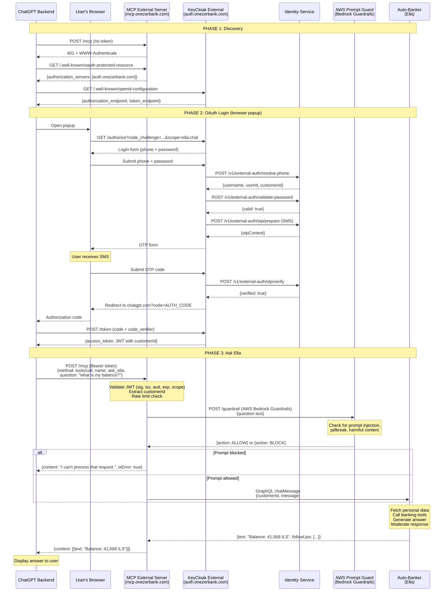

# STRIDE Threat Model — ChatGPT MCP Integration with Ella Auto-Banker

**System:** One Zero Bank — Ella exposed as an MCP tool inside ChatGPT via OAuth 2.1 / PKCE
**Scope:** MCP Server · OAuth 2.1 Authorization Server · IDM Service · Keycloak · AWS Bedrock PromptGuard · Ella Auto-Banker

---

## 1. Open Questions

> Based on the full design: Decision 1 (new Keycloak, selected), Decision 2 (App Push MFA, selected), and the complete mermaid sequence diagram. Questions build on top of the existing authentication security requirements.

---

### Phase 1 — Discovery

1. The MCP server returns a `401 + WWW-Authenticate` before authentication is even attempted — is this 401 response itself rate-limited to prevent it being used as a DoS amplifier?
2. Who has the ability to modify the `/.well-known/oauth-protected-resource` document, and is that change controlled and audited? A change to `authorization_servers` would silently redirect all ChatGPT logins to a different server.
3. The discovery document exposes `auth.onezerbank.com` as the authorization server — has DNSSEC been configured on `onezerbank.com` to prevent subdomain takeover?
4. If the `authorization_servers` value needs to be changed in an emergency (e.g., Keycloak key compromise), what is the rotation procedure and how quickly can it propagate to ChatGPT?

---

### Phase 2 — OAuth Login

**New Keycloak (Decision 1)**

5. The selected architecture adds a new Keycloak instance that the team has no prior experience with, and requires custom plugin development — who is responsible for security-reviewing those plugins before they go to production?
6. Who has admin access to the new Keycloak instance, and is that access logged and audited separately from application logs?
7. The new Keycloak connects to IDM, which connects to the existing Keycloak holding all customer credentials — if the new Keycloak instance is compromised, what is the blast radius on the existing production Keycloak?
8. The IDM change to allow a separate ChatGPT session alongside the mobile session breaks the existing "one session per user" invariant — can a compromised ChatGPT session be used to affect a customer's active mobile banking session?

**Login Flow — IDM endpoints**

9. `/v1/external-auth/resolve-phone` — does this endpoint return a different response for a registered vs. unregistered phone number? A distinct error here would allow an attacker to enumerate which phone numbers belong to One Zero customers.
10. The diagram shows SMS OTP (`/otp/prepare (SMS)`) but the selected MFA option is App Push (Option 3) — is SMS the fallback or the current state? If SMS is the fallback, has the SIM-swap risk been formally accepted?
11. `/v1/external-auth/otp/verify` — how many incorrect attempts are allowed before the account is locked? Is there rate limiting per phone number in addition to per source IP?
12. The App Push MFA requires IDM and Mobile to build new Push OTP functionality for web login (listed as a con in the design) — until that is built, what MFA method is in use, and has it been approved by security?
13. If the internal call from Keycloak to `/v1/external-auth/validate-password` times out or fails silently, does the OAuth flow fail safely or could it proceed with incomplete password verification?
14. The authorization code is redirected to `chatgpt.com` — how are redirect URIs validated: exact match only, or prefix/wildcard? Who controls the registered redirect URI list and who can add to it?

---

### Phase 3 — Ask Ella

15. The MCP server extracts `customerId` from the JWT — is this value passed as-is to the Ella GraphQL call `{customerId, message}`, and is it possible for the ChatGPT request body to override or inject a different `customerId` at any point between the MCP server and Ella?
16. Only `{question text}` is shown being sent to PromptGuard — what exactly is included in "question text"? Is it strictly the user's chat input, or could it include Ella's previous response, customer context, or financial data? Financial data sent to AWS Bedrock leaves One Zero's infrastructure.
17. When PromptGuard returns `BLOCK`, the MCP server returns a generic error — is the block decision logged with `customerId`, timestamp, and the rule that matched, for security monitoring and fraud detection?
18. If PromptGuard is unavailable (AWS outage or timeout), does the MCP server fail closed (block the request) or fail open (forward it to Ella anyway)? This decision is not defined in the current security requirements.
19. Ella "calls banking tools" as part of generating the answer — which tools can Ella invoke when called through ChatGPT? Is access strictly read-only, or can it trigger write operations such as transfers, payments, or account changes?
20. The response `{text: "Balance: 41,568 ILS", followUps: [...]}` contains real financial data — is this response logged anywhere between Ella and ChatGPT? If so, who has access to those logs and what is the retention policy?
21. The `followUps` field in Ella's response — are these pre-defined safe suggestions, or can their content be influenced by user input in a way that could facilitate a secondary prompt injection?

---

### Cross-Cutting — Full Design

22. The existing security requirement #5 (IP restriction to identify ChatGPT) is listed in the design — OpenAI does not publish fixed IP addresses. Has it been acknowledged that this control is unreliable and cannot replace token validation?
23. The existing audit log requirement covers authentication events only (biometric approval, Keycloak logs) — are there equivalent tamper-evident logs for every MCP tool call in Phase 3, including the PromptGuard verdict and Ella response status?
24. The design has no customer opt-in mechanism — is the ChatGPT integration disabled by default and only activated when a customer explicitly enables it?
25. The design has no customer-facing revocation — can a customer disable ChatGPT's access to their banking data at any time from within the One Zero app?
26. Ella's response (containing data such as "Balance: 41,568 ILS") flows through OpenAI's infrastructure — has Legal and Compliance approved this under GDPR, PSD2, and Israeli banking regulations?
27. Has OpenAI's data retention policy been reviewed — how long does OpenAI store customer financial data submitted through ChatGPT?
28. The design spans three separate teams (Keycloak, IDM, MCP/Ella) — who is the single security owner responsible for the end-to-end security of the full integration, and who is accountable if a cross-team gap is exploited?
29. If OpenAI discloses a breach involving One Zero customer financial data, is there an incident response plan that includes the ability to immediately revoke all tokens issued by the new Keycloak instance across all customers?

---

## 2. System Overview

### Architecture

### Trust Boundaries

| Boundary | Level | Notes |
|---|---|---|
| ChatGPT → MCP Server | Low (public internet) | External AI system; any actor can call the MCP server with a valid token |
| ChatGPT → OAuth Server | Low (public internet) | First-ever external-facing OAuth endpoint for One Zero |
| Browser → OAuth Server | Low (public internet) | Customer browser popup; PKCE flow over HTTPS |
| OAuth Server → IDM Service | Medium (internal) | New trust relationship; should use mTLS |
| IDM Service → Keycloak | Medium (internal) | Existing internal integration |
| IDM Service → SMS Provider | External | OTP delivery; outside One Zero's control |
| MCP Server → PromptGuard | External (AWS) | Customer prompt data leaves One Zero's infrastructure |
| MCP Server → Ella | Medium (internal) | Should use mTLS + service identity |
| Keycloak → JWKS consumers | Medium (internal + external) | JWKS must be cacheable but refreshable on key rotation |

### Key Assets

| Asset | Sensitivity | Notes |
|---|---|---|
| Customer JWT (access token) | Critical | Grants full MCP access to customer's banking data |
| Customer financial data (Ella response) | Critical | Account balances, transactions, portfolio — sent to OpenAI |
| OAuth authorization code | Critical | Short-lived; must be single-use |
| Keycloak signing keys | Critical | Compromise allows arbitrary token forgery |
| Customer phone number | High | Used as login identifier; enumeration risk |
| OTP code | High | Single-use credential; SMS delivery risk |
| Discovery documents | Medium | Tampering redirects ChatGPT to malicious server |
| PromptGuard verdicts | Medium | Decision log for prompt injection; must be audited |

### Key Data Flows

| Flow | Path | Trust Crossing |
|---|---|---|
| F1 — Discovery | ChatGPT → `/.well-known` endpoints | Public internet → One Zero |
| F2 — OAuth login | Browser → OAuth Server → IDM → Keycloak → JWT | Public internet → internal stack |
| F3 — OTP delivery | IDM → SMS Provider → Customer phone | Internal → external SMS |
| F4 — MCP tool call | ChatGPT → MCP Server (Bearer JWT) | Public internet → One Zero |
| F5 — PromptGuard check | MCP Server → AWS Bedrock | Internal → AWS external |
| F6 — Ella invocation | MCP Server → Ella (GraphQL) | Internal |
| F7 — Response to ChatGPT | Ella → MCP Server → ChatGPT | Internal → public internet → OpenAI |

---

## 3. STRIDE Threat Table

| ID | Category | Phase | Threat | Affected Component | Impact | Risk | Mitigation |
|---|---|---|---|---|---|---|---|
| S1 | Spoofing | 1 — Discovery | **Rogue OAuth server via discovery tampering** — attacker compromises the `/.well-known/oauth-protected-resource` document (e.g., via subdomain takeover or CDN cache poisoning) and replaces the `authorization_servers` URL with a malicious OAuth server; ChatGPT authenticates to the fake server and customer credentials / tokens are stolen | `/.well-known/oauth-protected-resource` (MCP Server) | Customer token theft; full access to customer banking data via MCP | Critical | Serve discovery documents over HTTPS with HSTS; use a CDN with signed content; monitor for unauthorized changes to the `authorization_servers` field; WAF on discovery endpoints |
| S2 | Spoofing | 2 — OAuth Login | **Customer identity spoofing via phone + OTP brute force** — attacker uses a known or guessed phone number, submits a correct password (obtained via credential stuffing), and brute-forces the OTP to complete authentication as a victim customer | OAuth Server → IDM (`/otp-verify`) | Unauthorized access to another customer's banking data via Ella | Critical | Maximum 3 OTP attempts before lockout; OTP with minimum 6 digits (≥ 1M entropy); OTP TTL ≤ 5 minutes, single-use; rate limit per phone number and per IP on `/otp-verify`; account lockout notification to customer |
| S3 | Spoofing | 3 — MCP Call | **Token replay attack** — attacker intercepts or exfiltrates a customer's JWT (e.g., from a compromised ChatGPT plugin, browser storage, or network log) and replays it against the MCP server to impersonate the customer | MCP Server (Bearer token) | Full access to victim customer's banking data until token expires | High | Short access token lifetime (≤ 1 hour); TLS required on all MCP endpoints (no HTTP fallback); token binding where supported; monitor for geographic anomalies in token usage |
| S4 | Spoofing | 2 — OAuth Login | **Redirect URI hijacking** — attacker registers a similar-looking ChatGPT redirect URI (or exploits wildcard redirect URI validation) to capture the authorization code during the PKCE callback | OAuth Server (`/authorize` redirect) | Authorization code captured; attacker exchanges it for a customer JWT | High | Exact-match redirect URI validation only; disable all wildcard and prefix-based redirect URI matching; validate redirect_uri on both `/authorize` and `/token` endpoints |
| S5 | Spoofing | 3 — MCP Call | **Internal service impersonation** — rogue internal service bypasses the MCP server and calls Ella's GraphQL endpoint directly, substituting an arbitrary `customerId` without going through JWT validation or PromptGuard | MCP Server → Ella (internal) | Cross-customer data access; prompt injection bypass; unauthorized banking actions | High | mTLS between MCP Server and Ella; Ella validates that caller is the MCP server (service identity); Ella enforces `customerId` from mTLS identity, not from request payload |
| T1 | Tampering | 1 — Discovery | **Discovery document MITM** — attacker performs a man-in-the-middle attack on the HTTP(S) connection to `/.well-known` endpoints to modify `authorization_servers` in transit | `/.well-known` endpoints → ChatGPT | ChatGPT authenticates to attacker's server; token theft | High | HSTS with long `max-age` and `includeSubDomains`; HTTPS only, no HTTP redirect; DNSSEC on `onezerbank.com`; certificate pinning in MCP client if feasible |
| T2 | Tampering | 2 — OAuth Login | **PKCE `state` parameter tampering** — attacker modifies the `state` parameter during the OAuth redirect to bypass CSRF protection, or replaces the `code_challenge` to invalidate the PKCE binding and perform a code injection attack | Browser → OAuth Server (`/authorize` → redirect) | CSRF on OAuth flow; potential cross-origin token issuance | High | `state` must be cryptographically random (≥128 bits), stored in browser sessionStorage or HttpOnly cookie, and validated server-side before processing the authorization response; `code_challenge` must be validated at the `/token` endpoint using the stored `code_verifier` |
| T3 | Tampering | 3 — MCP Call | **Prompt injection via MCP tool call** — adversarial content is injected into MCP tool call parameters by ChatGPT (or by a prompt injected into ChatGPT's context from an external source) to manipulate Ella's behavior — e.g., override its system prompt, extract customer data, or trigger unauthorized actions | MCP Server → PromptGuard → Ella | Unauthorized banking actions; data exfiltration via Ella's responses; jailbreak of Ella's guardrails | Critical | Schema-level input validation at MCP Server (field names, data types, max length, character allowlist) before PromptGuard; PromptGuard tuned for prompt injection and jailbreak patterns; Ella has its own hardened system prompt that cannot be overridden by user input |
| T4 | Tampering | 3 — MCP Call | **JWT claim tampering** — if JWT signature validation is misconfigured (e.g., accepting `alg: none`, weak HMAC key, or accepting RSA public key as HMAC secret), attacker modifies the `customerId` or `scope` claim to access a different customer's data or elevate permissions | MCP Server (JWT validation) | Cross-customer data access; scope elevation | Critical | Enforce asymmetric signing (RS256 or ES256) only; reject `alg: none`; never accept HMAC algorithms with a public key; validate all claims (`sub`, `iss`, `aud`, `exp`, `nbf`, `scope`) on every request |
| T5 | Tampering | 2 — OAuth Login | **Authorization code interception** — without PKCE, a captured authorization code can be exchanged for a customer JWT by any party; even with PKCE, a weak `code_challenge_method` (e.g., `plain`) reduces protection | OAuth Server `/token` endpoint | JWT issuance to an unauthorized party | High | Enforce `code_challenge_method=S256` only; reject `plain`; auth code must be single-use and expire within 60 seconds; reject `/token` requests where `code_verifier` does not match the stored `code_challenge` |
| R1 | Repudiation | 2 — OAuth Login | **Customer denies granting ChatGPT access** — if there is no durable consent record, a customer could claim they never authorized ChatGPT to access their banking data, creating regulatory and liability risk | OAuth consent mechanism | Regulatory non-compliance; liability disputes; inability to investigate unauthorized access complaints | High | Immutable audit log per authorization event: customerId, timestamp, scopes granted, client_id, IP address, consent screen version shown; store for minimum 7 years per financial regulation; log preserved separately from application DB |
| R2 | Repudiation | 3 — MCP Call | **No audit trail for MCP tool invocations** — if MCP tool calls are not logged, there is no evidence of which banking data was queried by ChatGPT on behalf of which customer, making fraud investigation and regulatory audit impossible | MCP Server → Ella | Inability to reconstruct data access history; regulatory exposure | High | Audit log per MCP invocation: customerId, tool name, input parameter metadata (sanitized — no raw financial data), PromptGuard verdict, Ella response status, timestamp; logs must be tamper-evident and access-controlled |
| R3 | Repudiation | 3 — MCP Call | **Ella response not logged** — if Ella's response content is not captured anywhere, there is no record of what financial data was disclosed to ChatGPT, preventing investigation if a data leak is suspected | Ella → MCP Server → ChatGPT | No evidence for data breach investigation; inability to scope a potential leak | Medium | Log response metadata (tool name, customerId, response category, timestamp) without logging full response bodies (to avoid creating a second copy of PII in logs); consider response signing for non-repudiation if regulatory requirements demand it |
| I1 | Information Disclosure | 3 — MCP Call | **Customer financial data sent to OpenAI's systems** — Ella's responses containing account balances, transaction history, loan details, or other PII are transmitted to ChatGPT, which is operated by OpenAI on their infrastructure outside One Zero's control | Ella → MCP Server → ChatGPT (OpenAI) | Cross-border PII transfer; potential regulatory breach (GDPR, PSD2, local banking law); customer data processed by a third-party AI outside banking boundary | Critical | Legal and compliance review before launch; explicit customer consent with plain-language scope disclosure; data minimization: Ella responses scoped to only what is necessary for the specific tool call; assess OpenAI's data processing agreement and retention policies |
| I2 | Information Disclosure | 2 — OAuth Login | **Phone number user enumeration** — the OAuth login flow (phone → IDM `/resolve-phone`) reveals whether a phone number is a registered One Zero customer through distinct error messages, timing differences, or HTTP status codes | OAuth Server → IDM `/resolve-phone` | Customer existence revealed to attacker; enables targeted credential stuffing, social engineering, and SIM-swap attacks | High | Consistent error messages and response times for registered vs. unregistered phone numbers; rate limit `/resolve-phone` calls per IP; do not expose whether a phone number exists in a 4xx error response body |
| I3 | Information Disclosure | 3 — MCP Call | **JWT claims visible to ChatGPT** — if the access token is a JWT (not opaque), ChatGPT can base64-decode it and read all claims including `customerId`, token lifetime, and any scope values | Bearer JWT → ChatGPT | Customer identifier and account metadata exposed to OpenAI's systems; could facilitate targeted attacks | Medium | Use opaque (reference) tokens externally: MCP server receives an opaque token, introspects it against the authorization server, and maps it to internal claims; if JWT must be used, minimize claims to only `sub` and `scope` — no `customerId`, name, email, or other PII |
| I4 | Information Disclosure | 2, 3 — All phases | **Error message information leakage** — internal errors from IDM, Keycloak, or Ella (e.g., "Keycloak connection timeout", "IDM user not found in LDAP", "Ella service unavailable") are returned to the external caller | OAuth Server, MCP Server (error responses) | Internal system architecture revealed to attacker; aids targeted attack planning | Medium | Map all internal errors to standard RFC 6749 OAuth error codes (`invalid_grant`, `server_error`, etc.) and generic MCP error codes; log full error details server-side only; never return stack traces, service names, or internal URLs to external callers |
| I5 | Information Disclosure | 3 — MCP Call | **Customer financial data in MCP server logs** — if the MCP server logs full request/response bodies for debugging, Ella's responses containing account balances and transaction data are stored in log systems accessible to engineers and potentially to log aggregation tools (e.g., ELK, Splunk) | MCP Server logging | Unauthorized access to customer financial data by internal engineers; PII stored beyond its intended scope | High | PII field masking in logs; log only metadata (tool name, customerId hash, timestamp, PromptGuard verdict, response status code); log access controls with least-privilege; retention policy aligned with data classification |
| I6 | Information Disclosure | 3 — MCP Call | **Customer data sent to AWS Bedrock PromptGuard** — the PromptGuard inspection payload may include the customer's chat message plus Ella's context (PDJ, financial data), meaning sensitive data leaves One Zero's infrastructure and is processed by AWS | MCP Server → AWS Bedrock Guardrails | Customer financial data processed by third-party cloud outside One Zero's direct control | High | Review and minimize what is sent to PromptGuard: inspect only the user-facing prompt, not Ella's internal context or financial data; assess AWS's data processing agreement for Bedrock Guardrails; consider on-premise or VPC-hosted prompt inspection as an alternative |
| D1 | Denial of Service | 2 — OAuth Login | **OAuth endpoint flooding** — attacker floods the `/authorize` or `/token` endpoints, exhausting OAuth server capacity and blocking all customer logins | OAuth Server, IDM, Keycloak | All ChatGPT + Ella authentication blocked; service unavailable | High | Rate limiting at WAF/API gateway on all OAuth endpoints; IP-based throttling; CAPTCHA challenge after N failed attempts from same IP; Keycloak deployed in HA mode; circuit breaker between OAuth Server and IDM/Keycloak |
| D2 | Denial of Service | 2 — OAuth Login | **SMS OTP bombing** — attacker triggers mass OTP SMS delivery to victim customer's phone by repeatedly initiating the login flow with the victim's phone number | IDM Service → SMS Provider | Victim customer's phone flooded with unwanted SMS; SMS provider costs inflated; victim unable to complete legitimate login due to OTP confusion | High | Rate limit OTP delivery per phone number (e.g., max 3 requests per 30 minutes); rate limit per source IP; require proof-of-work or CAPTCHA before OTP delivery; alert operations on OTP delivery spikes |
| D3 | Denial of Service | 3 — MCP Call | **MCP server flooding with valid tokens** — a compromised customer account or automated script hammers the MCP server with valid JWTs, consuming MCP, PromptGuard, and Ella resources | MCP Server, PromptGuard, Ella | Service degradation or unavailability for all customers; Ella overwhelmed | High | Rate limiting per `customerId` and per source IP; global request rate limit protecting Ella; circuit breaker between MCP Server and Ella; queue-based MCP request processing for burst absorption |
| D4 | Denial of Service | 3 — MCP Call | **PromptGuard latency cascade** — AWS Bedrock Guardrails experiences elevated latency or an outage; since PromptGuard is synchronous in the MCP call path, all Ella invocations stall and timeout | PromptGuard → MCP Server → Ella | All ChatGPT + Ella interactions blocked for the duration of the Bedrock outage; cascading failure | Medium | PromptGuard call must have a tight timeout (e.g., 2 seconds); on timeout, fail closed (return error to ChatGPT, do not allow request through); circuit breaker pattern to fast-fail during Bedrock degradation; alert and runbook for Bedrock outage |
| D5 | Denial of Service | 2 — OAuth Login | **OTP / auth code enumeration as amplifier** — attacker submits millions of guessed auth codes against `/token` to trigger excessive Keycloak validation load, amplifying a low-volume attack into a resource exhaustion | OAuth Server `/token` endpoint | Keycloak CPU/DB exhaustion; auth code validation degradation | Low | Auth codes must be cryptographically random (≥ 128 bits) making enumeration infeasible; rate limit `/token` per client_id and IP; failed `/token` attempts with unknown codes must count toward lockout |
| E1 | Elevation of Privilege | 2 — OAuth Login | **OAuth scope elevation** — ChatGPT (or a malicious actor controlling the OAuth client) requests broader scopes during the `/authorize` step than the ChatGPT integration is entitled to (e.g., requesting a `transfer_funds` scope when only `read_account` should be allowed) | OAuth Server `/authorize` (scope request) | Customer grants ChatGPT write/transactional access beyond what is intended; unauthorized financial actions | Critical | Server-side scope allowlist per registered client; the OAuth server must reject any scope not pre-approved for the ChatGPT client_id; customer consent screen must only show approved scopes; scopes must follow principle of least privilege (read-only by default) |
| E2 | Elevation of Privilege | 3 — MCP Call | **Cross-customer data access via customerId substitution** — if the MCP server or Ella accepts `customerId` from the request payload or tool call parameters (rather than exclusively from the validated JWT), an attacker with a valid token can substitute a different `customerId` to access another customer's data | MCP Server → Ella (customerId extraction) | Unauthorized access to another customer's account data | Critical | `customerId` MUST be extracted exclusively from the validated JWT `sub` or custom claim; MCP tool call parameters MUST NOT contain or override `customerId`; Ella MUST reject any `customerId` that does not match the mTLS-authenticated caller's bound identity |
| E3 | Elevation of Privilege | 3 — MCP Call | **Prompt injection bypassing PromptGuard to execute unauthorized banking action** — adversarial content crafted to evade PromptGuard's detection passes through to Ella and causes Ella to execute an action outside the customer's intention (e.g., initiating a transfer, changing account settings) | PromptGuard → Ella Auto-Banker | Unauthorized financial transactions; data modification; reputational and financial damage | Critical | Defense in depth: PromptGuard as first layer, but Ella must also enforce its own action authorization (scope-based, not just PromptGuard ALLOW); write/transactional operations require a separate elevated scope not granted by default to the ChatGPT integration; immutable audit log of all Ella actions triggered via MCP |
| E4 | Elevation of Privilege | 2 — OAuth Login | **Consent scope escalation without re-consent** — after a customer initially grants ChatGPT access to `read_account`, the ChatGPT client re-initiates OAuth and silently acquires additional scopes (e.g., `read_transactions`, `read_loans`) without the customer realizing new permissions are being granted | OAuth consent mechanism | Customer's banking access scope expanded without informed consent | High | Any request for scopes beyond the originally consented set MUST trigger a full re-consent screen; the OAuth server must detect and flag scope expansion requests; `prompt=consent` must be enforced when new scopes are added |
| E5 | Elevation of Privilege | 2 — OAuth Login | **PKCE downgrade attack** — if the OAuth 2.1 server supports any non-PKCE grant type (implicit, resource owner password credentials, or Authorization Code without PKCE), an attacker can use the weaker flow to obtain a token without a `code_verifier`, bypassing PKCE's code interception protection | OAuth Server (grant type enforcement) | Token obtained without PKCE protection; auth code interception becomes exploitable | High | OAuth 2.1 server MUST only support Authorization Code + PKCE; all other grant types (implicit, ROPC, client credentials for this flow) MUST be disabled; reject any `/authorize` request that does not include a valid `code_challenge` and `code_challenge_method=S256` |

---

## 4. Risk Summary Matrix

| ID | Threat | Likelihood | Impact | Risk |
|---|---|---|---|---|
| S1 | Rogue OAuth server via discovery tampering | Medium | Critical | **Critical** |
| T3 | Prompt injection via MCP tool call | High | High | **Critical** |
| T4 | JWT claim tampering (alg confusion / weak signing) | Medium | Critical | **Critical** |
| I1 | Customer financial data sent to OpenAI systems | High | High | **Critical** |
| E1 | OAuth scope elevation | Medium | High | **Critical** |
| E2 | Cross-customer data access via customerId substitution | Medium | High | **Critical** |
| E3 | Prompt injection bypasses PromptGuard → unauthorized banking action | Medium | High | **Critical** |
| S2 | Customer identity spoofing via phone + OTP brute force | High | High | **Critical** |
| S4 | Redirect URI hijacking | Medium | High | **High** |
| T2 | PKCE state parameter tampering / CSRF | Medium | High | **High** |
| T5 | Authorization code interception (weak PKCE) | Medium | High | **High** |
| R1 | No immutable consent audit log | Medium | High | **High** |
| R2 | No audit trail for MCP tool invocations | High | High | **High** |
| I2 | Phone number user enumeration | High | Medium | **High** |
| I5 | Customer financial data in MCP server logs | Medium | High | **High** |
| I6 | Customer data sent to AWS Bedrock PromptGuard | High | Medium | **High** |
| D1 | OAuth endpoint flooding | Medium | High | **High** |
| D2 | SMS OTP bombing | High | Medium | **High** |
| D3 | MCP server flooding with valid tokens | Medium | High | **High** |
| E4 | Consent scope escalation without re-consent | Medium | High | **High** |
| E5 | PKCE downgrade attack | Low | High | **High** |
| S3 | Token replay attack | Low | High | **Medium** |
| S5 | Internal service impersonation (bypass MCP → Ella direct) | Low | High | **Medium** |
| T1 | Discovery document MITM | Low | High | **Medium** |
| R3 | Ella response not logged | Medium | Medium | **Medium** |
| I3 | JWT claims visible to ChatGPT (opaque token not used) | High | Low | **Medium** |
| I4 | Error message information leakage | High | Low | **Medium** |
| D4 | PromptGuard latency cascade | Medium | Medium | **Medium** |
| D5 | OTP / auth code enumeration as amplifier | Low | Medium | **Low** |

---

## 5. Security Requirements

### SR-AUTH — OAuth 2.1 & Authentication

| ID | Requirement | Priority | Threat(s) Addressed |
|---|---|---|---|
| SR-AUTH-1 | The OAuth 2.1 server MUST support Authorization Code + PKCE as the **only** grant type for this integration. Implicit grant, resource owner password credentials, and any Authorization Code flow without `code_challenge` MUST be disabled. | Critical | E5, T5 |
| SR-AUTH-2 | `code_challenge_method` MUST be `S256` only. `plain` MUST be rejected. The `code_verifier` MUST be between 43–128 characters, cryptographically random (PKCE RFC 7636). | Critical | T5, E5 |
| SR-AUTH-3 | The `state` parameter MUST be cryptographically random (≥ 128 bits of entropy), generated by the client, stored in browser `sessionStorage` or an `HttpOnly` cookie, and validated server-side before the authorization response is processed. | High | T2 |
| SR-AUTH-4 | Redirect URIs MUST be validated by exact-match only. Wildcard, prefix, and glob redirect URI patterns MUST be disabled. The redirect_uri MUST be validated on both the `/authorize` and `/token` endpoints. | Critical | S4 |
| SR-AUTH-5 | Authorization codes MUST be cryptographically random (≥ 128 bits), single-use, and expire within 60 seconds. The server MUST invalidate the code immediately upon successful exchange at the `/token` endpoint. | High | T5, D5 |
| SR-AUTH-6 | OTP delivery via SMS MUST be rate-limited to a maximum of 3 OTP requests per phone number per 30 minutes. OTP codes MUST expire within 5 minutes, be invalidated after first use, and allow a maximum of 3 verification attempts before account lockout. | Critical | S2, D2 |
| SR-AUTH-7 | The OAuth 2.1 server MUST be built on a certified, actively maintained OAuth 2.1 library or framework (e.g., Keycloak direct exposure, Spring Authorization Server, Ory Hydra). It MUST NOT be built from scratch without a formal security review and penetration test. | Critical | S1, T5, E5 |
| SR-AUTH-8 | An explicit customer consent screen MUST be shown before the JWT is issued, listing all requested scopes in plain language. Any request for new or expanded scopes MUST trigger a full re-consent screen; silent scope escalation MUST be rejected. | High | R1, E4 |

---

### SR-TOKEN — Token Security

| ID | Requirement | Priority | Threat(s) Addressed |
|---|---|---|---|
| SR-TOKEN-1 | Access tokens MUST have a maximum lifetime of 1 hour. Refresh tokens, if used, MUST be rotating (single-use) and have a maximum lifetime of 24 hours. Refresh tokens MUST be revocable by the customer via the One Zero app. | High | S3 |
| SR-TOKEN-2 | The MCP server MUST validate the JWT on every request: cryptographic signature (RS256 or ES256 only), `iss` (issuer), `aud` (audience bound to MCP server), `exp` (expiry), `nbf` (not-before), and required `scope` claims. Tokens failing any validation MUST be rejected with `401 Unauthorized`. | Critical | T4, S3 |
| SR-TOKEN-3 | The JWT signing algorithm MUST be RS256 or ES256. The server MUST reject tokens with `alg: none`, any HMAC algorithm (HS256, HS384, HS512), or any unknown algorithm. The JWKS endpoint MUST only publish the public signing key. | Critical | T4 |
| SR-TOKEN-4 | JWKS MUST be cached on the MCP server with a TTL ≤ 24 hours. An emergency JWKS refresh mechanism MUST exist that forces an immediate cache invalidation without a service restart (e.g., admin API endpoint or configuration reload signal). | High | T4 |
| SR-TOKEN-5 | The `customerId` MUST be extracted exclusively from validated JWT claims (`sub` or a dedicated custom claim). It MUST NOT be accepted from MCP tool call parameters, HTTP headers, query strings, or any other client-supplied source. | Critical | E2 |
| SR-TOKEN-6 | External-facing tokens SHOULD be opaque reference tokens (not JWTs) to prevent claim leakage to ChatGPT/OpenAI. If JWTs are used externally, claims MUST be minimized to `sub` (non-PII identifier) and `scope` only — no `customerId`, name, email, phone, or account information. | Medium | I3 |

---

### SR-MCP — MCP Server Security

| ID | Requirement | Priority | Threat(s) Addressed |
|---|---|---|---|
| SR-MCP-1 | The MCP server MUST return `401 Unauthorized` with a `WWW-Authenticate` challenge for all unauthenticated or token-invalid requests. Error response bodies MUST NOT contain internal system details, service names, stack traces, or error messages from IDM/Keycloak/Ella. | High | I4 |
| SR-MCP-2 | PromptGuard (AWS Bedrock Guardrails) MUST be invoked before every Ella invocation. If PromptGuard is unavailable (timeout, error, or outage), the MCP server MUST **fail closed** — return an error to ChatGPT and NOT forward the request to Ella. | Critical | E3, T3, D4 |
| SR-MCP-3 | Rate limiting MUST be enforced per authenticated `customerId` (JWT `sub`) and per source IP. Per-customer limits MUST be defined (e.g., 60 requests/minute, 500 requests/day). A global rate limit MUST protect Ella from aggregate load. | High | D3 |
| SR-MCP-4 | MCP tool call parameters MUST be validated at the MCP server before reaching PromptGuard: schema validation (allowed field names only), data type enforcement, maximum field length limits, and character allowlist enforcement. Requests with unexpected parameters MUST be rejected. | Critical | T3, E3 |
| SR-MCP-5 | The PromptGuard inspection payload MUST be minimized: only the user-facing prompt text SHOULD be sent to AWS Bedrock. Ella's internal context, customer financial data (PDJ), account details, and transaction data MUST NOT be included in the PromptGuard payload. | High | I6 |
| SR-MCP-6 | The connection between the MCP server and Ella MUST use mTLS with service identity verification. Ella MUST reject any inbound GraphQL call that does not originate from the MCP server's verified certificate. | High | S5 |

---

### SR-DATA — Data Privacy & Minimization

| ID | Requirement | Priority | Threat(s) Addressed |
|---|---|---|---|
| SR-DATA-1 | A legal and compliance review MUST be completed and signed off before the ChatGPT MCP integration is launched in production. The review MUST cover: (a) cross-border PII transfer to OpenAI's infrastructure, (b) GDPR / local banking regulatory requirements, (c) OpenAI's data retention and processing agreement. | Critical | I1 |
| SR-DATA-2 | Customers MUST explicitly opt in to the ChatGPT integration before any banking data is accessible via MCP. The integration MUST be disabled by default. Customers MUST be able to revoke consent and disable ChatGPT's access at any time via the One Zero app. | Critical | I1, R1 |
| SR-DATA-3 | Ella's responses via MCP MUST be scoped to the minimum data necessary for the specific tool call. Bulk account data, full transaction history, or sensitive fields (e.g., full account numbers, credit scores) MUST NOT be returned unless the tool call specifically requires them and the customer has consented to that scope. | High | I1, E1 |
| SR-DATA-4 | PII and financial data (account numbers, balances, transaction details, customer name) MUST NOT appear in MCP server logs. Logs MUST contain only metadata: customerId hash (not plaintext), tool name, PromptGuard verdict, response status code, and timestamp. | High | I5 |
| SR-DATA-5 | An incident response plan MUST be in place for the scenario where OpenAI discloses a breach involving customer data obtained via MCP. The plan MUST include: immediate token revocation for all ChatGPT-issued tokens, customer notification procedure, and regulatory breach reporting timeline. | High | I1 |

---

### SR-AUDIT — Audit & Logging

| ID | Requirement | Priority | Threat(s) Addressed |
|---|---|---|---|
| SR-AUDIT-1 | Every OAuth authorization event MUST be logged in an immutable audit store: customerId (or phone hash before auth), scopes granted, client_id, consent screen version, IP address, and timestamp. Logs MUST be retained for the minimum period required by applicable financial regulations. | High | R1 |
| SR-AUDIT-2 | Every MCP tool invocation MUST be audit-logged: customerId, tool name, input parameter schema (not raw values), PromptGuard verdict (ALLOW/DENY/TIMEOUT), Ella response status, and timestamp. Logs MUST be tamper-evident and stored with access controls. | High | R2 |
| SR-AUDIT-3 | Authorization failures (`401`, `403`) on the MCP server MUST be logged and trigger alerting when: (a) ≥ 5 failures from the same `customerId` within 5 minutes, or (b) ≥ 20 failures from the same IP within 1 minute. These patterns indicate probing or token stuffing. | High | S3, T4 |
| SR-AUDIT-4 | PromptGuard DENY verdicts MUST be logged with the `customerId`, timestamp, and PromptGuard rule matched. A spike in DENY verdicts (e.g., > 3 from the same customer in 10 minutes) MUST trigger a security alert for manual review. | High | T3, E3 |
| SR-AUDIT-5 | All privileged OAuth server management operations (client registration, scope changes, redirect URI changes) MUST be logged with actor identity and require a separate privileged credential to perform. | Medium | E1, E4 |

---

### SR-SUPPLY — Supply Chain & Third-Party Risk

| ID | Requirement | Priority | Threat(s) Addressed |
|---|---|---|---|
| SR-SUPPLY-1 | The OAuth 2.1 server implementation MUST undergo a dedicated security penetration test before launch, covering: PKCE flows, redirect URI validation, scope enforcement, token validation, and OTP brute-force resistance. | Critical | S2, T5, E5 |
| SR-SUPPLY-2 | The PromptGuard integration MUST be reviewed for what data is transmitted to AWS Bedrock. A data processing agreement (DPA) with AWS for Bedrock Guardrails MUST be in place before production launch. | High | I6 |
| SR-SUPPLY-3 | The `/.well-known/oauth-protected-resource` and `/.well-known/openid-configuration` documents MUST be monitored for unauthorized content changes. Any change to the `authorization_servers` or `issuer` fields MUST trigger an immediate security alert. | High | S1, T1 |
| SR-SUPPLY-4 | OAuth library dependencies and the MCP server framework MUST be included in One Zero's dependency scanning pipeline (SBOM, CVE monitoring). Critical security patches MUST be applied within 72 hours of disclosure. | High | S1, T4 |
| SR-SUPPLY-5 | An architecture review of the full ChatGPT → MCP → Ella data flow MUST be conducted with One Zero's Data Protection Officer (DPO) before launch to assess whether a Data Protection Impact Assessment (DPIA) is required under applicable regulation. | High | I1, SR-DATA-1 |
